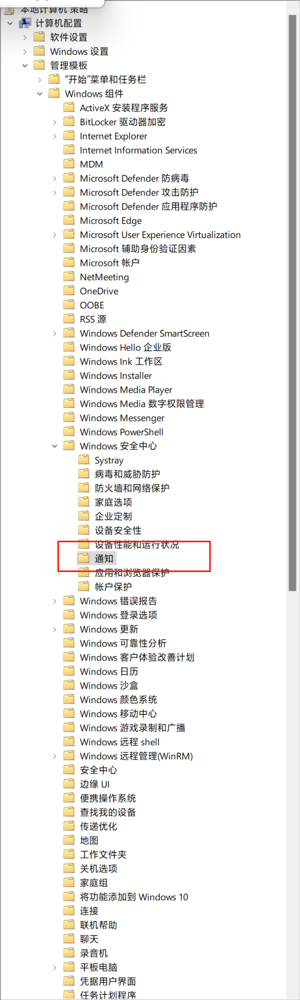

# 重装指南

## 检查系统更新

## 替换系统字体

## 安装谷歌浏览器

登录账号，同步设置。

## 激活

简单个性化设置。

## 应用商店更新软件

中间可能需要重启。

## 用联想工具关闭 Windows Defence

控制面板\所有控制面板项\安全和维护\更改安全和维护设置

关闭防火墙通知

----------------------------------

这部分详细参考 `ps-notes`

## 安装 Chocolatey

安装必备软件。

## 任务栏设置成 Windows 10 风格

果核剥壳

## 设置 Windows Terminal

## 设置 Powershell

## 设置 Git

## 设置 WSL2

## 设置 Docker

